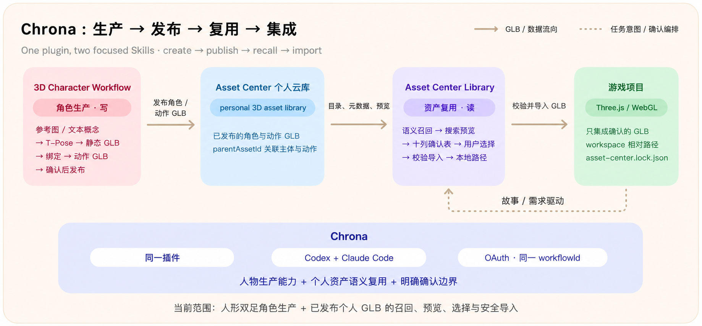
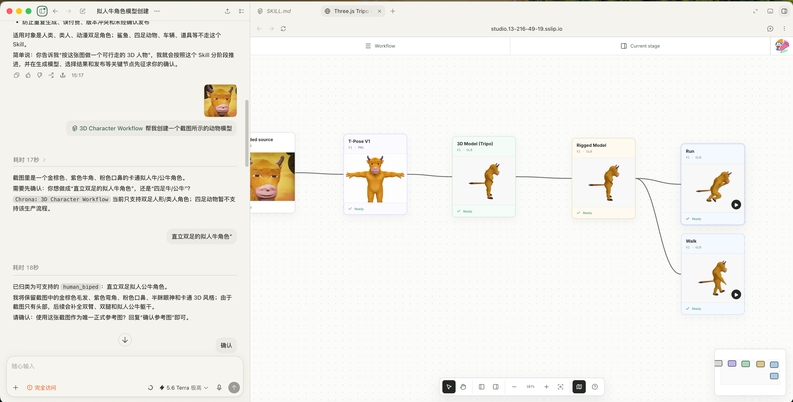

<div align="center">
  <h1>Your AI 3D Asset Library & Character Assistant</h1>
  <p>Find and reuse production-ready GLB assets, or create, rig, animate, and publish human characters without leaving your coding workflow.</p>
  <p>
    <a href="https://studio.13-216-49-19.sslip.io/asset-center/"></a>
    
    
  </p>
  <h3>Install with one prompt</h3>
  <p>Paste this into any Codex task or Claude Code session. It installs the Chrona plugin, verifies it, and then asks you to start a new task or session.</p>
</div>

```text
/goal Read https://raw.githubusercontent.com/Alterverse-tech/chrona-3d-assets/main/INSTALL.md to install the Chrona 3D Assets plugin, then set up a new task or session for me.
```

## Components and boundaries

One repository, one marketplace (`chrona-3d-assets`), and one plugin (`chrona`) containing two focused Skills:



```text
Chrona
├── Asset Center Library
└── 3D Character Workflow
```

| Skill | Type | Owns | Authentication |
|---|---|---|---|
| `Chrona: Asset Center Library` | Skill + MCP | Read and reuse side of your personal library: semantic recall, search, preview, confirmed selection, and safe GLB import | Asset Center OAuth / service token |
| `Chrona: 3D Character Workflow` | Skill + MCP | Write and production side for human-biped characters: reference → T-Pose → GLB → rig → actions → publish | Asset Center OAuth / service token |

`3D Character Workflow` produces reusable characters and linked action GLBs in your personal Asset Center library. `Asset Center Library` finds those published assets later and brings only the confirmed files into a game project.

The two Skills share one install and one authentication model, but each can be used independently.

## Highlights

- **One plugin for Codex and Claude Code** — the same `plugins/chrona` package carries both host manifests, the two Skills, their MCP servers, OAuth, and the sourcing-board UI
- **Reuse before import** — search your personal library semantically, preview real candidates, and compare them in a complete ten-column asset sourcing board
- **Fresh confirmation for every task** — historical plans can help prefill a proposal, but only the active task's confirmation authorizes an import
- **Safe local integration** — confirmed GLBs are pulled into a workspace-relative package; signed download URLs never enter game code, and existing imports are tracked in `asset-center.lock.json`
- **Human-biped character production** — turn a selected person or humanoid/anime reference into a T-Pose, static GLB, rigged character, retargeted actions, and published Asset Center assets
- **One shared workflow across hosts** — Codex, Claude Code, and the browser Workbench continue the same character workflow by its workflow ID
- **Explicit generation and publishing gates** — model generation, output selection, action selection, and publishing require the user's confirmation at the relevant stage

<details>
<summary><b>How the two workflows look</b></summary>

### Reuse a personal asset

1. Describe the game, scene, or exact model you need.
2. Chrona reads the personal Asset Center catalog and proposes relevant reusable models and linked actions.
3. Review previews and choose one option per requirement.
4. Confirm the complete sourcing plan once; Chrona imports only the selected published GLBs.

### Create a human character

1. Provide a person or humanoid/anime reference, or ask the host to create temporary concepts.
2. Select one source before the formal 3D Character Workflow begins.
3. Review and approve the T-Pose, static model, rig, and requested actions as the workflow advances.
4. Publish only after a final explicit confirmation; the character and its linked actions then become reusable through Asset Center Library.

</details>

## Installation

The one-prompt installer at the top handles both Skills. To install manually, add the marketplace and install the single `chrona` plugin.

### Codex

```bash
codex plugin marketplace add Alterverse-tech/chrona-3d-assets --ref main --json
codex plugin add chrona@chrona-3d-assets --json
```

Verify:

```bash
codex plugin marketplace list --json
codex plugin list --json
```

### Claude Code

```bash
claude plugin marketplace add Alterverse-tech/chrona-3d-assets
claude plugin install chrona@chrona-3d-assets
```

Verify:

```bash
claude plugin marketplace list
claude plugin list
```

Start a new Codex task or Claude Code session after installation so both Skills and their MCP tools are discovered.

## Asset Center Library in action

Use `Chrona: Asset Center Library` when you want to inspect or reuse assets you have already published to Asset Center.

```text
看看我 Asset Center 里有哪些带动画的角色。
```

```text
根据这个故事，为当前 Three.js 游戏制定资产方案，优先复用我已有的模型。
```

```text
把我那个复古飞机模型拉进当前游戏。
```

Direct lookup uses search → ambiguity confirmation when needed → workspace import. Story-driven sourcing reads the catalog once, matches models and actions in context, renders one complete proposal, and waits for one final confirmation before importing anything.

The Skill imports published GLBs only. It does not generate, edit, upload, or publish assets. Procedural-prop entries may inform a sourcing plan, but they are not downloaded as GLBs.

## 3D Character Workflow in action

Use `Chrona: 3D Character Workflow` to create and publish a human-biped character from a chosen visual reference.



<p align="center"><sub><b>上传参考图 → T-Pose → 3D Model → Rigged Model → Run / Walk 动作 GLB</b><br>Codex conversation and Asset Center Workbench advance the same workflow.</sub></p>

```text
用这张参考图创建一个可绑定的人形角色。
```

```text
为这个动漫人物生成 T-Pose、绑定骨骼，再制作 idle、walk 和 run 动作。
```

```text
继续我现有的 Character Workbench 工作流，并把确认后的角色和动作发布到 Asset Center。
```

The workflow supports a person or humanoid/anime character with biped proportions. Creatures, sharks, fish, quadrupeds, vehicles, props, environments, and scenes are intentionally outside this 3D Character Workflow and are never disguised as biped jobs.

When a suitable reusable character or linked action does not exist, you can also open **[Design a Character Asset](https://studio.13-216-49-19.sslip.io/asset-center/characters/new)**. After the character and action GLBs are published, future tasks can discover them through `Asset Center Library`.

## Repository structure

```text
chrona-3d-assets/
├── .agents/plugins/marketplace.json        # Codex marketplace
├── .claude-plugin/marketplace.json         # Claude Code marketplace
├── plugins/chrona/
│   ├── .codex-plugin/plugin.json
│   ├── .claude-plugin/plugin.json
│   ├── .mcp.json
│   ├── skills/
│   │   ├── asset-center-library/
│   │   └── 3d-character-workflow/
│   ├── scripts/
│   └── web/
├── INSTALL.md
└── README.md
```

This repository is the canonical source for the `chrona` plugin. Its current public surface is exactly the two Skills documented above: `Asset Center Library` and `3D Character Workflow`.

## Access and authentication

Installation itself needs no Asset Center token. On the first authenticated Asset Center Library or 3D Character Workflow operation, Chrona opens the Asset Center OAuth flow in the browser. Tokens remain on the user's machine.

Never paste an Asset Center token into chat or source code. `ASSET_CENTER_SERVICE_TOKEN` is only an optional environment override for CI or shared runners. Character generation may use provider credits, so paid or publishing stages stay behind explicit confirmation.

## License

Free for non-commercial use. Commercial use requires prior written permission.

---

<p align="center"><strong>Create the character. Reuse the library.</strong></p>
